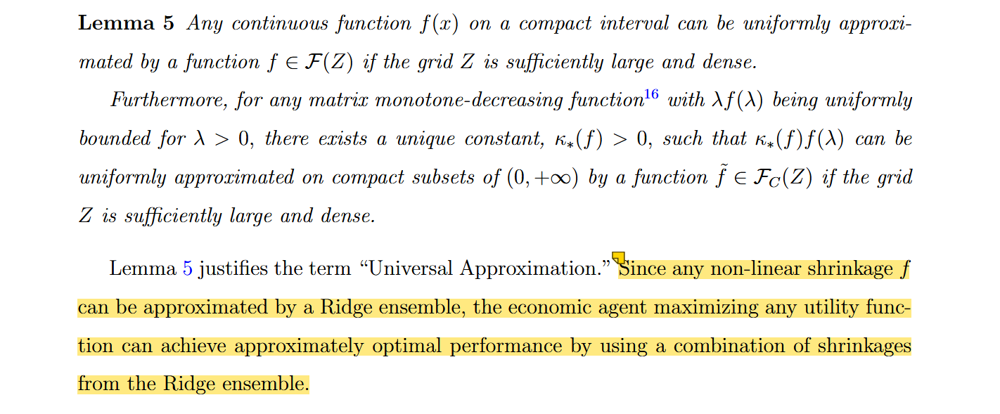

# Universal Portfolio Shrinkage

 **Journal:**

Working Paper, 2024

 **Authors:**

* Bryan Kelly:
  
  AQR Capital Management, Yale School of Management, and NBER
* Semyon Malamud:
  
  Swiss Finance Institute, EPFL, and CEPR, and is a consultant to AQR
* Mohammad Pourmohammadi:
  
  University of Geneva and Swiss Finance Institute
* Fabio Trojani

  University of Geneva, University of Turin and Swiss Finance Institute

## Abstract

We introduce a novel shrinkage methodology for building optimal portfolios in environments of <mark>high complexity</mark>, where the number of assets is comparable to or larger than the number of observations. Our universal portfolio shrinkage approximator (UPSA) is given in closed form, is easy to implement, and improves upon existing shrinkage methods. It exhibits an explicit two-fund separation, complementing the Markowitz portfolio with an optimal complexity correction. UPSA does not annihilate the low-variance principal components (PCs) of returns; instead, it optimally reweights them and produces a stochastic discount factor that substantially improves on its feasible PC-sparse counterparts.

## 1. Introduction

mean-variance 的问题：

- DeMiguel et al,.2009: mean-variance 方法在样本内表现优秀，但是样本外表现很差，没有 $1 / N$ 策略的表现好。
- Didisheim et al., 2023: 样本内和样本外表现的差异，是由于估计复杂性 (estimation complexity) 的存在，因为模型参数数量逐渐超过 T，大数定律不再适用。

传统的做法是通过收缩来优化 bias-variance tradeoff，但它们的问题是：限制收缩的形式；只关注一些统计目标，例如协方差的估计误差。而没有考虑**投资者真正关心的目标：SDF 的样本外表现。**

为了方便理解收缩的意义，本文的讨论建立在 PCA 的基础上。传统理论认为：只有前几个主成分对张成 SDF 有用，它们能解释大部分的横截面收益变动，因此它们有不可忽略的风险溢价（risk premia），因此低方差 PCs 应该有小的风险溢价（对横截面收益解释的少），在构造 SDF 时它们可以被忽略。

本文认为：当资产数量 N 很大时，低方差 PCs 的估计会受到噪声的强烈干扰。两个后果：

- 一些低方差 PCs 可能有较好的 risk-return tradeoff，在样本外不应该被忽略
  - statistical limits to arbitrage (Da et al., 2022)
  - limits to learning (Didisheim et al., 2023)
- 样本内低方差 PCs 的错误估计，可能会对**未被观测到的高方差 PCs** 有显著的暴露？

这两种情况下，low-variance PCs 可以提供较好的分散投资机会，所以不该被忽略。

---

CUPSA: constrained universal portfolio shrinkage approximator

用于对比的方法：

- ridge-shrunk portfolio
- Markowitz portfolio, where the covariance matrix pre-shrinked (Ledoit and Wolf, 2017)
- shrinking (KNS), both PC sparsity and Ridge shrinkage

## 2. Literature Review

1. Covariance estimation

- (Stein, 1986): 收缩样本协方差的特征值，而非特征向量
- Ledoit and Wolf: 线性收缩方法，加权样本协方差和单位阵的线性组合
- (Ledoit and Wolf, 2017): 最小化投资组合风险的 shrinkage 方法

2. SDF estimation with PCs

- (KNS, 2020): shrinking, sparse PCs
- (Lettau and Pelger, 2020): RP_PCA

3. Statistical Pricing Frictions and Complexity

- (Kelly et al., 2022): highlight theoretically and empirically the advantages of complex models in asset pricing
- (Didisheim et al., 2023): complexity wedge between in-sample (IS) and OOS performance

## 3. Optimal Portfolio Shrinkage

假设有 N 个资产 (factors)，它们的超额收益服从随机过程，$F_t \in \mathbb{R}^N$，在一个完备信息的市场中，一个经济代理人的效用函数为：

$$
U(R_t^\pi) = R_t^\pi - \frac{1}{2}(R_t^\pi)^2 \tag{1}
$$

其中 $R_t^\pi = \pi^\top R_t$ 是投资组合。为了最大化效用，最优投资组合权重为：

$$
\pi_* = E[FF']^{-1}E[F] \tag{3}
$$

这将得到期望效用：

$$
E[U(R_t^\pi)] = \frac{1}{2} E[F']E[FF']^{-1}E[F] \tag{4}
$$

---

现实世界中，一个经济代理人通过 $T$ 个样本内观测值来计算统计量：

$$
\begin{aligned}
    \bar{E}[FF'] &= \frac{1}{T} \sum_{t=1}^T F_t F_t', \\
    \bar{E}[F] &= \frac{1}{T} \sum_{t=1}^T F_t,
\end{aligned} \tag{5}
$$

并用它们来估计最优投资组合权重：

$$
\bar{\pi} = \bar{E}[FF']^{-1} \bar{E}[F] \tag{6}
$$

相应地，样本内期望效用为：

$$
\bar{u} = \frac{1}{T} \sum_{t=1}^T U(R_t^{\bar{\pi}}) = \frac{1}{2} \bar{E}[F]' \bar{E}[FF']^{-1} \bar{E}[F]
$$

我们将样本外期望效用表示为：$u^{OOS} = E[U(R_t^{\bar{\pi}})], \;\; t > T$

---

> When $c = N/T \not ={0}$, complexity leads to a breakdown of the law of large numbers, and empirical and theoretical moments diverge:

$$
\bar{E}[F] \not\to E[F], \quad \bar{E}[FF'] \not\to E[FF'] \tag{9}
$$

当 complexity c > 0 时，样本内期望效用和样本外期望效用之间的差异可以被表示为：

$$
\text{Wedge} = \bar{u} - u^{OOS} > 0
$$

> (Didisheim et al., 2023) refer to this wedge as limits to learning and show how this wedge originates in the misestimation of factor moments (9).
> The common approach in the literature for dealing with this misestimation is the shrinkage of the covariance matrix.

---

考虑主成分空间，旋转到 PC 空间的资产表示为：$R_{i,t}^{PC} = U_i' F_t$，同样地，$\bar{R}_i^{PC} = \bar{E}[R_{i,t}^{PC}]$。

此时，最优投资组合可以写为：

$$
R_t^{\bar{\pi}} = \sum_{i=1}^N \frac{\bar{R}_i^{PC}}{\lambda_i} R_{i,t}^{PC} \tag{11}
$$

> The estimated efficient portfolio return is the sum of PC returns, with each PC weighted by its estimated risk-return tradeoff.

当 N 很大时，对于小的 $\lambda_i$，$\frac{\bar{R}_i^{PC}}{\lambda_i}$ 可能会很大，这意味着低方差 PCs 会被高估，从而导致投资组合样本外表现很差。(可能的原因：每个主成分都是原始收益率序列的线性组合，当 N 很大时，最小的主成分在均值较大的几个原收益率序列上可能也会有较大的权重)

为了解决由小特征值带来的不稳定性，ridge 方法常被应用：

$$
R_t^{\bar{\pi}(z)} = \sum_{i=1}^N \frac{\bar{R}_i^{PC}}{\lambda_i + z} R_{i,t}^{PC} = \sum_{i=1}^N \frac{\bar{R}_i^{PC}}{\lambda_i} \frac{1}{1 + z / \lambda_i} R_{i,t}^{PC} \tag{13}
$$

两个特例：

- $z = 0$，等价于 mean-variance (N < T, >= 时取伪逆)
- $z = \infty$，等价于 "momentum" portfolio ($\bar{E}[F]$)

---

受套利定价理论的影响 (the conventional APT wisdom advocating SDF–sparsity in the PC space)，一些研究都是只保留前 k 个 PCs，而忽略剩下的 PCs。本文希望最优地确定每个 PC 的贡献。

> Formally, an estimator that only shrinks the weights of all PCs in (13) without modifying the PCs themselves is commonly referred to as a spectral shrinkage estimator.

A generic spectral shrinkage estimator is defined by a function f applied to the eigenvalues of the sample covariance matrix，协方差被替代为：

$$
f(\bar{E}[FF']) = U \, \text{diag}(f(\lambda)) U'
$$

最优投资组合权重变为：

$$
\bar{\pi}(f) = \underbrace{f(\bar{E}[FF'])}_{\text{shrunk inverse covariance matrix}} \bar{E}[F] \tag{17}
$$

因此最优组合 $R_f(f)$ 可以写为：

$$
R_t(f) = \bar{\pi}(f)' F_t = \sum_{i=1}^N \; \underbrace{f(\lambda_i) \bar{R}_i^{PC}}_{\text{shrunk PC weights}} R_{i,t}^{PC} \tag{18}
$$

---

**Definition 1 (Optimal Non-linear Shrinkage)**. The optimal spectral shrinkage estimator is a function $f(\lambda; F_{IS})$ solves the **OOS** utility maximization problem:

$$
\max_f E[U(R_t(f))], \quad t > T \tag{19}
$$

为了找到最优 shrinkage，需要计算 19 式的样本外期望效用，但是 $E[F]$ 和 $E[FF']$ 都是未知的。

使用 Leave-One-Out (LOO) 方法来近似估计 (假设数据 iid)。

对任意时刻 $t$，定义 $t$ 时刻的 LOO 估计：

$$
\begin{aligned}
    \bar{E}_{T,t}[FF'] &= \frac{1}{T} \sum_{\tau \neq t, 1 \leq \tau \leq T} F_\tau F_\tau' \\
    \bar{E}_{T,t}[F] &= \frac{1}{T} \sum_{\tau \neq t, 1 \leq \tau \leq T} F_\tau
\end{aligned}
$$

于是 $t$ 时刻的最优投资组合权重为：

$$
\bar{\pi}_{T,t}(f) = f(\bar{E}_{T,t}[FF']) \bar{E}_{T,t}[F] \tag{21}
$$

对于任意 $t$，其样本外的表现为 $R_{T,t}(f) = \bar{\pi}_{T,t}(f)' F_t$，本质是用样本内除了 $t$ 时刻的数据来估计最优投资组合权重，然后用 $t$ 时刻的数据来计算投资组合的表现。通过计算样本内所有时刻的平均表现，可以得到样本外期望效用。

> [!TIP|label:TIP]
> 这里的 LOO 方法本质是 k-fold cross-validation，k = 样本数量 T

Lemma 1

$$
U^{OOS}_{LOO}(f) = \frac{1}{T} \sum_{\tau=1}^T U(R_{T,\tau}(f)) \tag{23}
$$

是样本外期望效用的一个无偏估计：

$$
E[U(R_t(f))] = E[U^{OOS}_{LOO}(f)], \quad t > T \tag{24}
$$

从 23 式可以看出，通过求解 $\max_f U^{OOS}_{LOO}(f)$ 可以得到最优的 shrinkage estimator $f$。

**Definition 2 (Optimal Non-linear Feasible Shrinkage)** The optimal feasible spectral shrinkage estimator is a function $f$ solving the utility maximization problem:

$$
\max_f U^{OOS}_{LOO}(f) \tag{25}
$$

但这仍然很复杂，因为需要求解 $T$ 次 LOO 估计量，并且在这 $T$ 个估计量的特征值上来评估 $f$。

下部分将提出一个更简单的方法，得到具体的解析解。

## 4. Universal Portfolio Shrinkage Approximator

**Lemma 2 (LOO Ridge Performance)** 建立样本内最优投资组合和样本外最优投资组合之间的关系：

$$
R_{T,\tau}(f_z) = \underbrace{\frac{1}{1 - \psi_\tau(z)}}_{\text{complexity multiplier}} \left( R_\tau(f_z) - \underbrace{\psi_\tau(z)}_{\text{overfit}} \right) \tag{27}
$$

其中 $R_\tau(f_z) = \bar{\pi}(f_z)' F_\tau, \quad \tau \leq T$ 是样本内最优投资组合的收益

$$
\psi_\tau(z) = \frac{1}{T} F_\tau'(zI + \bar{E}[FF'])^{-1} F_\tau \tag{29}
$$

复杂性修正 (complexity correction) 体现在两个方面：

- The overfit term accounts for the fact that the in-sample mean of the efficient portfolio return **overestimates the true mean**.
- The complexity multiplier accounts for the fact that the in-sample covariance matrix **underestimates the true amount of risk** in the portfolio.

> By Sherman-Morrison formula, $\psi_\tau(z) \in (0, 1)$, so the multiplier $\frac{1}{1 - \psi_\tau(z)}$ is always greater than 1.

---

Lemma 3: Assuming all factor returns, $F_t$, are bounded by a constant $K$ in absolute value, then:

$$
\psi_\tau(z) < \min\{1, z^{-1} c K^2\}
$$

- 当 $c$ 很小时，$\psi_\tau(z)$ 会趋向于 0。
- 即使 $T$ 很大，如果 $c > 0$，误差仍然会很大 (proportional to $c$)。

复杂性修正的两个 effect 表明，如果不考虑 **复杂性修正**，样本内会乐观估计最优投资组合的风险收益权衡。尤其是 c 很大时，这种偏差会很大。

---

**Definition 3**，Let $Z = (z_i)_{i=1}^L $ be a grid of Ridge penalties, and $W = (w_i)_{i=1}^L$ a collection of weights.

$$
f_{Z,W}(\lambda) = \sum_{i=1}^L \underbrace{(z_i + \lambda)^{-1}}_{\text{Ridge}} \underbrace{w_i}_{\text{weight}} \tag{34}
$$

We refer to $\mathcal{F}(Z) = \{f_{Z,W}(\lambda) : W \in \mathbb{R}^L\}$ as the Ridge ensemble, and $\mathcal{F}_C(Z) = \{f_{Z,W}(\lambda) : W \in \mathcal{S}_+^L\}$ as the constrained Ridge ensemble, where $\mathcal{S}_+^L = \{ W \in \mathbb{R}_+^L, \sum_{i=1}^N w_i / c_{z_i} = 1\}$

**Lemma 4**

LOO-based estimators of the OOS means and convariances:

$$
\begin{aligned}
    \bar{\mu}(Z) &= \left( \frac{1}{T} \sum_{t=1}^T R_{T,t}(f_{z_i}) \right)_{i=1}^L \in \mathbb{R}^L \\
    \bar{\Sigma}(Z) &= \left( \frac{1}{T} \sum_{t=1}^T R_{T,t}(f_{z_i}) R_{T,t}(f_{z_j}) \right)_{i,j=1}^L \in \mathbb{R}^{L \times L}
\end{aligned} \tag{35}
$$

于是 25 式的样本外期望效用可以写为：

$$
U^{OOS}_{LOO}(f_{Z,W}) = W' \bar{\mu}(Z) - 0.5 W' \bar{\Sigma}(Z) W \tag{37}
$$

---

Formally, we define the UPSA and CUPSA estimators as solutions to the following versions of 25:

$$
\begin{aligned}
    f_{UPSA} &= \arg \max_{f \in \mathcal{F}(Z)} U^{OOS}_{LOO}(f)\\
    f_{CUPSA} &= \arg \max_{f \in \mathcal{F}_C(Z)} U^{OOS}_{LOO}(f)
\end{aligned} \tag{38}
$$

**Theorem 1 (UPSA and CUPSA)**

$$
\begin{aligned}
    f_{UPSA}(\lambda) &= f_{Z, W_{UPSA}}(\lambda)\\
    f_{CUPSA}(\lambda) &= f_{Z, W_{CUPSA}}(\lambda)
\end{aligned} \tag{39}
$$

with

$$
\begin{aligned}
    W_{UPSA} &= \bar{\Sigma}(Z)^{-1} \bar{\mu}(Z)\\
    W_{CUPSA} &= \arg \max_{W \in \mathcal{S}_+^L} \left( W' \bar{\mu}(Z) - 0.5 W' \bar{\Sigma}(Z) W \right)
\end{aligned} \tag{40}
$$

### 4.1 Implications of Complexity

4.1.1 Optimality of Non-Linear Shrinkage

**Corollary 4 (Non-Zero Shrinkage is Always Optimal)**

$$
\sup_{z > 0} U^{OOS}_{LOO}(f_z) > U^{OOS}_{LOO}(f_0) \tag{45}
$$

and the supremum is always achieved for some $z_* > 0$. The gains from ridge shrinkage are bounded from above by 0.5 $\frac{-2 \psi(0; c) + \psi(0, c)^2}{(1 - \psi(0, c))^2}$

4.1.2 Two-Fund Separation

**Theorem 5 (Two-Fund Separation)**

$$
\bar{\pi}(f_{UPSA}) = \alpha \underbrace{\bar{\pi}(f_0)}_{\text{Markowitz}} + \beta \underbrace{\bar{\pi}^\psi}_{\text{complexity correction}} \tag{46}
$$

其中 $\bar{\pi}^\psi = \sum_{z \in Z} \underbrace{\bar{\pi}(f_z)}_{\text{Ridge portfolio}} \left(D(Z)^{-1} \Sigma_{IS}(Z)^{-1} \psi(Z)\right)(z)$

这表明在高复杂性环境下，最优投资组合可以分解为两个部分：来自 Markowitz 的部分和 complexity correction 的部分。复杂度越高，复杂性修正也会越高，意味着最优投资组合会偏离 Markowitz 投资组合。

### 4.2 Economic Imterpretations of CUPSA

Definition 3 中的 $\mathcal{S}_+^L$ 限制了 Ridge weights 的和为 1，可以通过贝叶斯的视角来解释。

**Lemma 6**: Consider an economic agent who (irrationally) believes that $\Sigma = \bar{E}[FF'] - \bar{E}[F]\bar{E}[F]'.$ She only cares about the mean, building a portfolio proportional to the posterior mean estimate, $\pi^{\text{mean}} = E[F_{T+1} | F_{IS}].$ The agent believes that $F_t = \mu + \varepsilon_t \text{ where } \varepsilon_t \sim N(0, \Sigma)$ is i.i.d., and the prior on $\mu$ is a Gaussian mixture: $\mu$ is sampled from $N(0, z_i I)$ distribution with probability $(w_i / z_i)/\bar{w}$, where $\bar{w} = \sum_j (w_j / z_j)$

Then,

$$
\begin{aligned}
    E[\mu | F_{IS}] &= \frac{1}{\bar{w}} \sum_{i=1}^L w_i (z_i I + \Sigma)^{-1} \bar{E}[F]\\
    &= \sum_{i=1}^L \frac{\widehat{w}_i}{c_{z_i}} c_{z_i} (z_i I + \Sigma)^{-1} \bar{E}[F]
\end{aligned}
$$

> The Gaussian mixture prior from Lemma 6 can be viewed as an extension of the simpler, single−z prior in (Kozak et al., 2020)

CUPSA 可以理解为对持有不同先验信念的投资者的汇总。