# Carry

 **Journal:**

Journal of Financial Economics (2018.2)

 **Authors:**

* Ralph S.J. Koijen:
  
  Stern School of Business, New York University, NBER and CEPR
* Tobias J. Moskowitz:
  
  Yale School of Management, NBER and AQR
* Lasse Heje Pedersen:
  
  AQR Capital Management, Copenhagen Business School, and CEPR

## Abstract

We apply the concept of carry, which has been studied almost exclusively in currency markets, to any asset. <mark>A security’s expected return is decomposed into its “carry,” an ex-ante and model-free characteristic, and its expected price appreciation</mark>. Carry predicts returns cross-sectionally and in time series for a host of different asset classes, including global equities, global bonds, commodities, US Treasuries, credit, and options. <mark>Carry is not explained by known predictors of returns from these asset classes, and it captures many of these predictors, providing a unifying framework for return predictability</mark>. We reject a generalized version of Uncovered Interest Parity and the Expectations Hypothesis in favor of models with varying risk premia, in which carry strategies are commonly exposed to global recession, liquidity, and volatility risks, though none fully explains carry’s premium.

## Introduction

> [!TIP|label:Carry Trade]
> The carry trade <mark>borrows low interest rate currencies</mark> and <mark>invests in high interest rate currencies</mark> hoping that the high interest rate currency appreciates versus the low interest rate currency. 
> Uncovered interest rate parity argues that high interest rate currencies are expected to depreciate to offset the interest differential.

之前有关 carry 的研究，基本都是围绕 currency，本文将 carry 应用到更多资产类别。

---

任何证券的收益可以分解为三部分：carry, expected and unexpected price appreciation

$$
\begin{equation}\label{(1)}
\mathrm{return} = \underbrace{\mathrm{carry + E(price\ appreciation)}}_{\mathrm{expected\ return}} + \mathrm{unexpected\ price\ shock} \tag{1}
\end{equation}
$$

**资产的期望收益等于其 carry 加上预期价格增长。**

- Carry: `model-free` characteristic directly observable ex ante from futures (or synthetic futures) prices, without relying on any particular model.
- Expected price appreciation: must be estimated by asset pricing models.

贡献：

- 过去的很多研究只关注特定的资产类别，并在各自类别中寻找解释性最好的 predictors，忽视了不同资产的收益率如何同时变动；而 carry 能够为不同资产类别提供预测性，也即统一的预测框架。
- carry 也能够和每类资产中的 predictors 联系起来，但提供更多的预测性。

## 2. Carry: a characteristic of any asset

**Model:**

在 $t$ 时刻，考虑一个期货合约，它在 $t+1$ 时到期，当前期货价格为 $F_t$，标的证券的现货价格为 $S_t$。假设投资者为每个期货合约缴纳 $X_\mathrm{t}$ 美元保证金（其中 $X_t$ 需满足保证金要求）。

下一期，保证金资本和期货合约的价值等于 $X_t(1+r_t^f)+F_{t+1}-F_t$，其中 $r_t^f$ 是当前保证金资本上的无风险利率。

于是每单位资本在一个周期内的回报率是：

$$
\begin{equation}\label{(2)}
r_{t+1}^\text{total return}=\frac{X_t(1+r_t^f)+F_{t+1}-F_t-X_t}{X_t}=\frac{F_{t+1}-F_t}{X_t}+r_t^f \tag{2}
\end{equation}
$$

超额收益率为：

$$
\begin{equation}\label{(3)}
r_{t+1}=\frac{F_{t+1}-F_t}{X_t} \tag{3}
\end{equation}
$$

**Definition of carry:**

假设 $t$ 期到 $t+1$ 期，资产的现货价格 $S_t$ 保持不变 ➡️ $S_{t+1}=S_t$，于是 $F_{t+1} = S_{t+1}=S_t$，carry 定义为：

$$
\begin{equation}\label{(4)}
C_t=\frac{S_t-F_t}{X_t} \tag{4}
\end{equation}
$$

即<i>现货价格在持有期间保持不变时，期货头寸的收益</i>。这一定义表明 <u>carry 可以从当前的期货和现货价格中直接观察到，而无需估计未来变量</u>。

基于 carry 的定义，我们可以将期货的 excess return 分为三个部分：

$$
\begin{equation}\label{(5)}
r_{t+1}=\frac{S_{t+1}-S_t+S_t-F_t}{X_t}=\underbrace{C_t+E_t\left(\frac{\Delta S_{t+1}}{X_t}\right)}_{E_t(r_{t+1})} + u_{t+1} \tag{5}  
\end{equation}
$$

其中，

$\qquad \Delta S_{t+1}=S_{t+1}-S_t$ 是资产的价格变化，还可以写为：

$\qquad \Delta S_{t+1} = E_t(\Delta S_{t+1}) + S_{t+1} - E_t(S_{t+1})$

$\qquad \mu_{t+1} = (S_{t+1} - E_t(S_{t+1}) ) / X_t$ 是未预期的价格波动，其期望为 0

从 $\ref{(5)}$ 式也可以看出，资产的期望收益等于其 carry 加上预期价格增长。其中价格增长的部分依赖资产定价模型来预测，而 carry 可以直接观察到。

而 carry 还受到 $X_t$ 的影响，例如 $X_t$ 减小一倍，carry 和收益率都将翻倍。为了不受 $X_t$ 的影响，通常假设 $X_t = F_t$ (conservative)，即 fully collateralized position。

于是 carry 的定义变为：

$$
\begin{equation}\label{(6)}
C_t=\frac{S_t-F_t}{F_t} \tag{6}
\end{equation}
$$

 

> [!NOTE|label:Note]
> 在期货交易中，"fully collateralized position"（全额抵押头寸）是指投资者为其期货合约持有的头寸提供足够的抵押品（或保证金），以覆盖该头寸可能产生的最大潜在损失。这种情况下，投资者存入的资金或其他形式的保证金大于等于期货合约可能导致的最大损失。全额抵押头寸是期货交易中的一种常见交易方式，它可以有效地降低投资者的交易风险。

本文的研究对象，eight diverse asset classes:

<table class="centertable" style="width:730px;">
  <tr>
    <th id="th1l" style="width:180px">Asset Class</th>
    <th id="th1c">Specific Assets</th>
  </tr>
  <tr>
    <td id="td1l">Currencies</td>
    <td id="td1c">spot and onemonth-forward rates for 19 countries</td>
  </tr>
  <tr>
    <td id="td1l">Equities</td>
    <td id="td1c">13 markets: US (S&amp;P 500), Canada (S&amp;P TSE 60) .etc</td>
  </tr>
  <tr>
    <td id="td1l">Global Bonds</td>
    <td id="td1c">synthetic futures returns for ten countries</td>
  </tr>
  <tr>
    <td id="td1l">Commodities</td>
    <td id="td1c">metals, energy, and agriculture and livestock</td>
  </tr>
  <tr>
    <td id="td1l">US Treasuries</td>
    <td id="td1c">US Treasuries 1-10 years of maturity</td>
  </tr>
  <tr>
    <td id="td1l">Credit</td>
    <td id="td1c">US credit portfolios</td>
  </tr>
  <tr>
    <td id="td1l">Call Index Options</td>
    <td id="td1c">US equity index options</td>
  </tr>
  <tr>
    <td id="td3l">Put Index Options</td>
    <td id="td3c">US equity index options</td>
  </tr>
</table>

### 2.1 Currency carry

首先研究货币市场的 carry，在此之前货币市场的 carry 是学术研究的重点。

Important concept: <a class="a1" href="https://www.investopedia.com/terms/u/uncoveredinterestrateparity.asp" target="_blank" rel="noopener noreferrer">Uncovered Interest rate parity (UIP)</a>

无套利条件下，货币远期合约的价格是：

$$
F_{t}=S_{t}(1+r_{t}^{f})/(1+r_{t}^{f*})
$$

根据 $\ref{(6)}$ 式，货币的 carry 是：

$$
\begin{equation}\label{7}
C_t=\frac{S_t-F_t}{F_t}=\bigl(r_t^{f*}-r_t^{f}\bigr)\frac{1}{1+r_t^{f}} \tag{7}
\end{equation}
$$

currency 的 carry 约等于两地利率差 $r_t^{f*}-r_t^{f}$。

现实中，UIP 不一定成立，但依然可以使用 $\ref{(6)}$ 式计算 carry。

### 2.2 Global equity carry

无套利条件下，股票远期合约的价格是：

$$
F_{t}=S_{t}(1+r_{t}^{f})-E_{t}^{Q}(D_{t+1})
$$

其中 $S_t$ 是股票的现货价格，$D_{t+1}$ 是股票的股息。

proof
 

<table>
    <tr>
        <th id="th1"></th>
        <th id="th1c">time $t$</th>
        <th id="th1c">time $T$</th>
    </tr>
    <tr>
        <td id="td1l">Long forward</td>
        <td id="td1c">0</td>
        <td id="td1c">$S_T - F_t$</td>
    </tr>
    <tr>
        <td id="td1l">Short stock</td>
        <td id="td1c">$S_t$</td>
        <td id="td1c">$-S_T - D$</td>
    </tr>
    <tr>
        <td id="td3l">Deposit</td>
        <td id="td3c">$-S_t$</td>
        <td id="td3c">$S_t (1+r^f)$</td>
    </tr>
    <tr>
        <td id="td3l">Net payoff</td>
        <td id="td3c">0</td>
        <td id="td3c">$S_t (1+r^f) - D - F_t$</td>
    </tr>
</table>

根据 $\ref{(6)}$ 式，股票的 carry 是：

$$
\begin{equation}\label{(8)}
C_t=\frac{S_t-F_t}{F_t}=\left(\frac{E_t^Q(D_{t+1})}{S_t}-r_t^f\right)\frac{S_t}{F_t} \tag{8}
\end{equation}
$$

可以理解为股票的**期望股息收益率减去无风险利率**，乘以一个 scaling factor $S_t/F_t$

> This expression for the equity carry is intuitive because, if stock prices stay constant, the stock return comes solely from dividends.

有关价值投资的文献研究历史股息率 (backward-looking)，而本文研究的是期望股息率 (forward-looking)，两者并不相同。

example：考虑戈登增长模型，

$$
S_t = \frac{D}{E(R)-g}
$$

$g$ is dividend growth rate, also the expected price appreciation.

$$
E(R) - r^f = \underbrace{D/S - r^f}_{carry} \qquad + \underbrace{g}_{expected\ price\ appreciation}
$$

根据 (Campbell and Shiller, 1988) 的研究，如果 $E(R)$ 增长，而股息保持不变，则股票价格会降低，于是股息收益率会增加。

因此，高的期望收益率意味着高的 carry。

### 2.3 Commodity carry

无套利条件下，商品远期合约的价格是：

$$
F_{t}=S_{t}(1+r_{t}^{f}-\delta_{t})
$$

其中 $\delta_t$ 是商品的存储成本。

proof
 

<table>
    <tr>
        <th id="th1"></th>
        <th id="th1c">time $t$</th>
        <th id="th1c">time $T$</th>
    </tr>
    <tr>
        <td id="td1l">short forward</td>
        <td id="td1c">0</td>
        <td id="td1c">$F_t - S_T$</td>
    </tr>
    <tr>
        <td id="td1l">Long commodity</td>
        <td id="td1c">$-S_t$</td>
        <td id="td1c">$S_T - S_t \delta$</td>
    </tr>
    <tr>
        <td id="td3l">Deposit</td>
        <td id="td3c">$S_t$</td>
        <td id="td3c">$-S_t (1+r^f)$</td>
    </tr>
    <tr>
        <td id="td3l">Net payoff</td>
        <td id="td3c">0</td>
        <td id="td3c">$F_t - S_t (1+r^f \color{red}{+}$ $\delta)$</td>
    </tr>
</table>

根据 $\ref{(6)}$ 式，商品的 carry 是：

$$
\begin{equation}\label{(9)}
C_t=\frac{S_t-F_t}{F_t}=\left(\delta_t-r^f\right)\frac1{1+r^f-\delta_t} \tag{9}
\end{equation}
$$

可以理解为商品的存储成本减去无风险利率，乘以一个 scaling factor。

### 2.4 Carry for finite-maturity securities

定义 $C_t^{\tau}$ 是 $t$ 时刻持有到期时间为 $\tau$ 的 carry

$$
\begin{equation}\label{(10)}
C_{t}^{\tau}=\frac{S_{t}^{\tau-1}-F_{t}^{\tau}}{F_{t}^{\tau}} \tag{10}
\end{equation}
$$

$F_{t}^{\tau}$: 标的资产存续期为 $\tau$ 且下一期交割的远期合约价格

$S_{t}^{\tau-1}$: 存续期为 $\tau-1$ 的现货价格

这里假设对于标的资产存续期相同的远期合约，其现货价格相同：$S_{t+1}^{\tau-1} = S_{t}^{\tau-1}$

$t+1$ 时，证券的到期时间为 $\tau-1$，对应现货价格 $S_{t+1}^{\tau-1}$

可能是用 $\ref{(3)}$ 式的方式求 carry，即关注资产持有期间的收益。

### 2.5 Global bond carry

到期时间为 $\tau$，到期收益率为 $y_{t}^{\tau}$ 的**零息债券**价格为：$S_{t}^{\tau}=\cfrac{1}{(1+y_{t}^{\tau})^{\tau}}$

对应的单期期货合约价格为：$F_{t}^{\tau}=(1+r_{t}^{f})S_{t}^{\tau}$

根据 $\ref{(10)}$ 式，the carry of $\tau$ period bond is:

$$
\begin{equation}\label{(11)}
  C_t^\tau=\frac{(1+y_t^\tau)^\tau}{(1+r_t^f)(1+y_t^{\tau-1})^{\tau-1}}-1 \tag{11}
\end{equation}
$$

The forward rate is $f_t^{\tau - 1, \tau} = \cfrac{(1+y_t^\tau)^\tau}{(1+y_t^{\tau-1})^{\tau-1}}$, we can rewrite carry:

$$
\begin{equation}\label{(12)}
  C_{t}^{\tau}=\frac{f_{t}^{\tau-1,\tau}-r_{t}^{f}\; \color{red}{-1}}{1+r_{t}^{f}} \tag{12}
\end{equation}
$$

若假设 $t \to t+1$ 时，收益率曲线不变，即 $y_{t}^{\tau}=y_{t}^{\tau-1}$，则：

$$
C_t^\tau=\cfrac{y_t^{\tau}-r_t^f}{1+r_t^f}
$$

即 carry 是零息债券的单期超额收益率 (adjusted for the risk-free rate)。

---

$\ref{(11)}$ 式用来准确计算 carry，也可以根据债券的修正久期来粗略估计：

$$
\begin{equation}\label{(13)}
  C_t^\tau\simeq(\underbrace{y_t^\tau-r_t^f}_{\mathrm{slope}})\underbrace{-D^{mod}\left(y_t^{\tau-1}-y_t^\tau\right)}_{\mathrm{roll~down}} \tag{13}
\end{equation}
$$

根据 $\ref{(13)}$ 式，carry 可以分解为两部分：

- slope: the bond's yield spread to $r_f$, also called slope of the term structure
- roll down: which captures the price increase due to the fact that the bond rolls down the yield curve.

### 2.6 Carry across treasuries of different maturities

考虑到期时间为 $1 \sim 10$ 年的美国国债。使用类似 bond 的方法计算 carry，但是调整了头寸规模 $X_t$ 的大小。

Example: a long \$1 10-year bond and short \$1 1-year bond portfolio is dominated by the 10-year bond.

为了将不同债券的波动率 scale 到相同水平，本文考虑久期调整的债券收益率，或者调整头寸规模 $X_t = F_t^{\tau} D_t^{\tau}$

于是 carry 可以写为：

$$
\begin{equation}\label{(14)}
  C_t^\tau(X=F_t^\tau D_t^\tau)=\frac{C_t^\tau(X=F_t^\tau)}{D_t^\tau} \tag{14}
\end{equation}
$$

proof

$$
\begin{aligned}
  C_t^\tau(X=F_t^\tau D_t^\tau)&= \frac{S_{t}^{\tau-1}-F_{t}^{\tau}}{X_t} \\
  {}\\
  &=\frac{S_{t}^{\tau-1}-F_{t}^{\tau}}{F_t^{\tau} D_t^{\tau}}\\
  {}\\
  &=\frac{C_t^\tau(X=F_t^\tau)}{D_t^\tau}
\end{aligned}
$$

头寸规模调整后，return 也会对应地根据久期调整。

### 2.7 Carry of the slope of global yield curves

研究每个国家收益率曲线的斜率：long the 10-year bond and short the 2-year bond，这个收益率曲线斜率的 carry 是：

$$
\begin{equation}\label{15}
  C_{t}^{\mathbf{slope}}=C_{t}^{10Y}(X=F_{t}^{10Y}D_{t}^{10Y})-C_{t}^{2Y}(X=F_{t}^{2Y}D_{t}^{2Y}) \tag{15}
\end{equation}
$$

### 2.8 Credit market carry

考察按期限和信用质量排序的美国信贷资产组合的 carry，使用 $\ref{(11)}$ 和 $\ref{(14)}$ 式计算 carry。

### 2.9 Option carry

研究美国股指期权的 carry。

- $G^{\mathrm{Call}}(\tau, \;\text{К}; \;S_t, \; \sigma_{t,\tau})$
- $G^{\mathrm{Put}}(\tau, \;\text{К}; \;S_t, \; \sigma_{t,\tau})$

 

- $\tau$: time to maturity
- $\text{К}$: strike price
- $S_t$: underlying stock price
- $\sigma_{t,\tau}$: implied volatility

A synthetic one-month futures that currently has maturity $\tau$ with futures price $\mathcal{F}_t^\tau=(1+\mathcal{r}_t^f) G^j(\tau,\mathcal{K};\mathcal{S}_t,\sigma_{t,\tau})$, where $j=\text{Call},\text{Put}$

根据 $\ref{(10)}$ 式，期权的 carry 是：

$$
\begin{equation}\label{(16)}
  C_t^j(\tau,K)=\frac{G^j(\tau-1,K;S_t,\sigma_{t,\tau-1})}{(1+r_t^f)G^j(\tau,K;S_t,\sigma_{t,\tau})}-1 \tag{16}
\end{equation}
$$

---

$\ref{(16)}$ 式用来准确计算 carry，也可以根据期权的到期时间 $\theta$ 和隐含波动率 $\nu$ 来粗略估计：

$$
\begin{equation}\label{(17)}
  G^j(\tau-1,K;S_t,\sigma_{t,\tau-1}) \simeq G^j(\tau,K;S_t,\sigma_{t,\tau})+\theta_t^j(-1)+\nu_t^j(\sigma_{t,\tau-1}-\sigma_{t,\tau}) \tag{17}
\end{equation}
$$

we can rewrite carry as (adjusting for the risk-free rate):

$$
\begin{equation}\label{(18)}
  C_t^j(\tau,K)\simeq\frac{-\theta_t^j+\nu_t^j(\sigma_{\tau-1}-\sigma_\tau)}{G^j(\tau,K;S_t,\sigma_{t,\tau})}-r^f \tag{18}
\end{equation}
$$

> The size of the carry is therefore driven by the time decay (via $\theta$), which often leads to a negative carry, and the “roll down” on the implied volatility curve (via $\nu$).

## 3. Carry and expected returns

这一部分主要研究不同种类资产中 carry 和期望收益率的关系。

### 3.1 Data and summary statistics

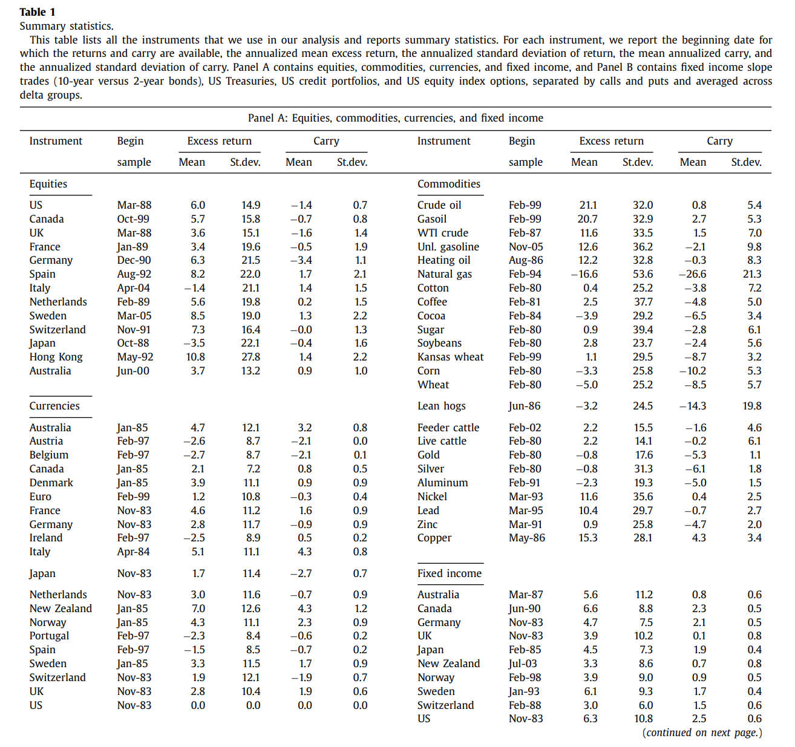

> Not surprisingly, commodities exhibit the largest cross-sectional variation in mean and standard deviation of returns as they contain the most diverse assets, covering commodities in metals, energy, and agriculture and livestock.

> Bonds exhibit the least cross-sectional variation across markets, but substantial variation still exists in average returns and volatility across the markets.

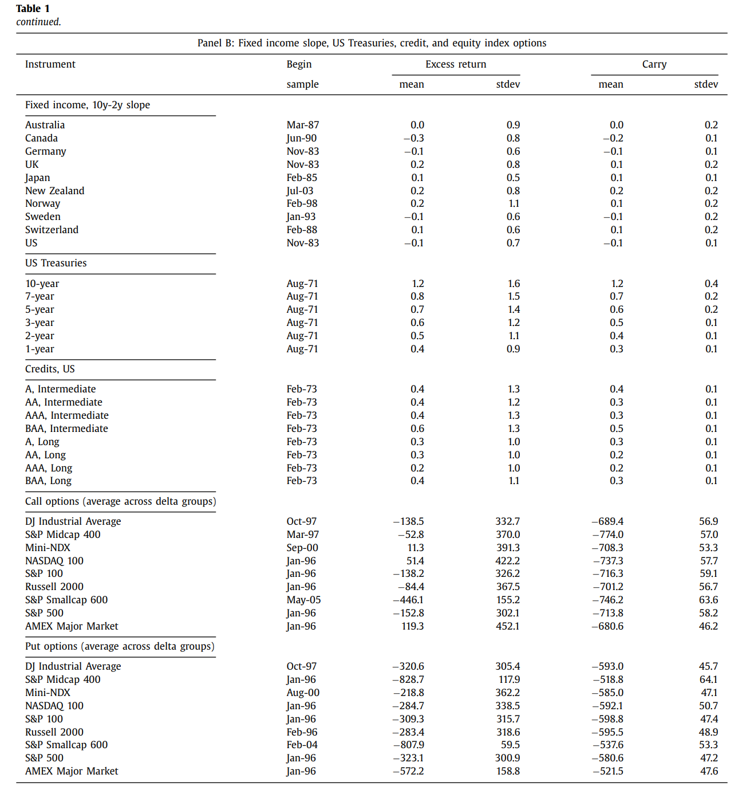

计算 `Excess return mean` 和 `Carry mean` 的相关性，结果如下：

<table class="centertable" style="width:330px;">
  <thead>
    <tr>
      <th id="th1l" style="width:230px">Asset Class</th>
      <th id="th1" style="width:100px">Corr</th>
    </tr>
  </thead>
  <tbody>
    <tr>
      <td id="td1l">Equities</td>
      <td id="td1"><strong>-0.004</td>
    </tr>
    <tr>
      <td id="td1l">Currencies</td>
      <td id="td1">0.862</td>
    </tr>
    <tr>
      <td id="td1l">Commodities</td>
      <td id="td1">0.326</td>
    </tr>
    <tr>
      <td id="td1l">Fixed income</td>
      <td id="td1">0.593</td>
    </tr>
    <tr>
      <td id="td1l">Fixed income, 10Y-2Y slope</td>
      <td id="td1">0.963</td>
    </tr>
    <tr>
      <td id="td1l">US Treasuries</td>
      <td id="td1">0.998</td>
    </tr>
    <tr>
      <td id="td1l">Credit (US)</td>
      <td id="td1">0.897</td>
    </tr>
    <tr>
      <td id="td1l">Call options</td>
      <td id="td1">0.324</td>
    </tr>
    <tr>
      <td id="td3l">Put options</td>
      <td id="td3">-0.902</td>
    </tr>
  </tbody>
</table>

### 3.2 Defining a carry trade portfolio

?> A carry trade is a trading strategy that goes long high-carry securities and shorts low-carry securities.

一种方法是根据 carry 将资产排序，利用前 $x\%$ 和后 $x\%$ 的资产构建 equal-weighted long-short 组合，类似 Fama-French 三因子；

另一种方法也是根据 carry 将资产排序，利用所有资产构建 value-weighted long-short 组合，类似 managed portfolios

The weight on each security i at time t is given by：

$$
\begin{equation}\label{(19)}
  w_t^i=z_t\bigg(\operatorname{rank}(C_t^i)-\frac{N_t+1}2\bigg) \tag{19}
\end{equation}
$$

> The scalar $z_t$ ensures that the sum of the long and short positions equals 1 and −1, respectively.

The return of the carry trade portfolio is:

$$
\begin{equation}\label{(20)}
  r_{t+1}^{\text{carry trade}}=\sum_{i=1}^{N_t}w_t^ir_{t+1}^i \tag{20}
\end{equation}
$$

两种计算 carry 的方式：

- `current carry` or `carry1m`: measured at the end of each month
- `carry1-12`: moving average of the past 12 months, smoothes potential seasonal components

carry 本身也是收益率，因此 carry trade portfolio 的 carry 也是加权平均：

$$
\begin{equation}\label{(21)}
  C_t^{portfolio}=\sum_iw_t^iC_t^i \tag{21}
\end{equation}
$$

The carry of the carry trade portfolio is equal to the weighted-average carry of the high carry securities minus the average carry among the low carry securities:

$$
\begin{equation}\label{(22)}
  C_t^\text{carry trade}=\sum_iw_t^iC_t^i=\sum_{w_t^i>0}w_t^iC_t^i-\sum_{w_t^i<0}|w_t^i|C_t^i>0 \tag{22}
\end{equation}
$$

因此 carry trade portfolio 的 carry 总是正的。

### 3.3 Carry trade portfolio returns within an asset class

对于每类资产，使用 $\ref{(19)}$ 式的方式构造 carry strategy。**The portfolio is rebalanced every month.**

Table 1 报告了每种资产类别中，以及不同资产间 carry 的差异。Tabel 2 则在每类资产中分别构造了 carry trade portfolio：

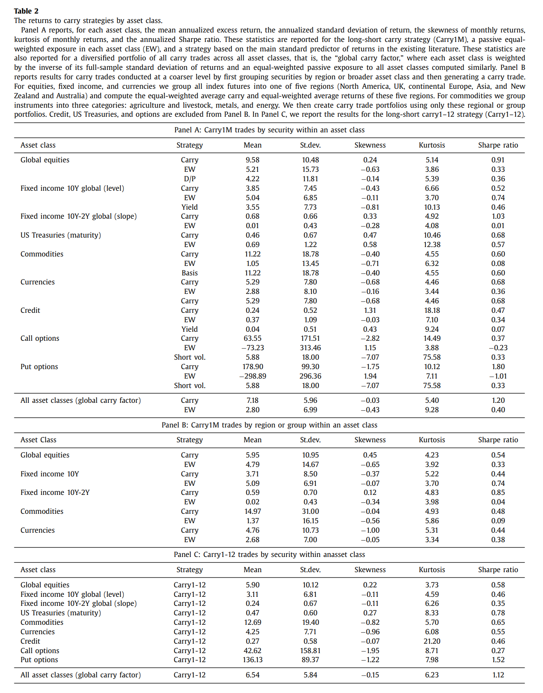

作为对比，这里也构造了等权重的被动长期组合 $EW$，结果表明：

- 大部分资产中，carry trade portfolio 的 SR 高于 EW，global bonds 除外
- 资产的平均 SR
  - carry trade portfolio: 0.78
  - EW: 0.13 (0.41 if short options)
  
每类资产的第三行：研究以往研究中能解释该类资产收益、且与 carry 相关的 predictor，并同样使用 $\ref{(19)}$、$\ref{(20)}$ 的方式构造 long-short portfolio

- equities: dividend yield (D/P)
  - literature: historical dividend yield
  - carry: expected dividend yield
- global fixed income and credit: yield spread
- options: short volatility
- currencies: carry

---

对比各类资产中，不同 carry strategy 的 Sharpe ratio。

<!-- 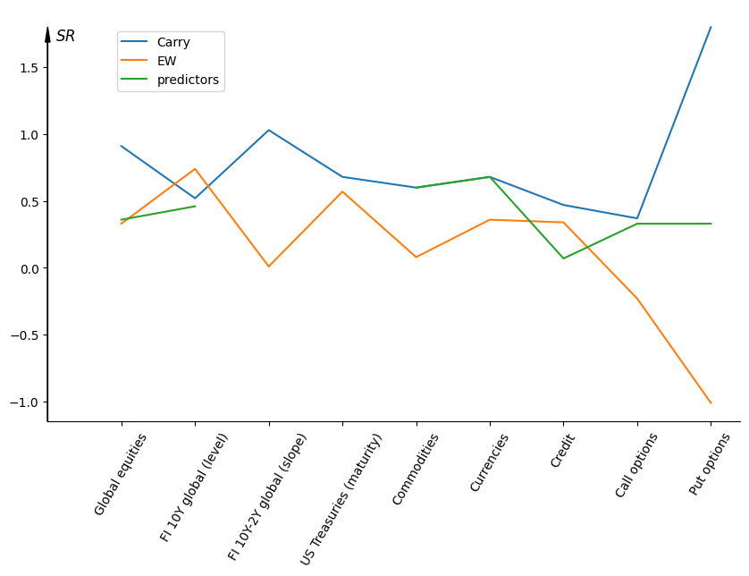 -->

<ul class="slides" style="width:770px; height:550px">
    <input type="radio" name="radio-btn1" id="img-3" checked />
    <li class="slide-container">
        

            
        

        

            <label for="img-4" class="prev">&#x2039;</label>
            <label for="img-4" class="next">&#x203a;</label>
        

    </li>
    <input type="radio" name="radio-btn1" id="img-4" />
    <li class="slide-container">
        

            
        

        

            <label for="img-3" class="prev">&#x2039;</label>
            <label for="img-3" class="next">&#x203a;</label>
        

    </li>
    <li class="nav-dots">
        <label for="img-3" class="nav-dot" id="img-dot-3"></label>
        <label for="img-4" class="nav-dot" id="img-dot-4"></label>
    </li>
</ul>

---

Panel B 以粗略的方式研究 carry trade portfolio：根据地区和更大的资产类别将资产划分，再在新的资产类别中构造 carry trade portfolio。这样处理的目的是研究 carry trade portfolio 是由地区差异还是区域内资产类别差异驱动的。

- equities: North America, UK, continental Europe, Asia, and New Zealand/Australia
- commodities: metals, energy, and agriculture and livestock

例：对于 equities，计算 5 个区域的 equal-weighted carry 和 equal-weighted return，然后使用这两个序列构造 carry trade portfolio。

可以看到，这些组合的 SR 略低于分散的 carry trade portfolio。说明 carry trade portfolio 是由地区间差异驱动的。

---

Panel C 研究 carry1-12 strategy，其 SR 略低于 carry1m strategy。

<!-- 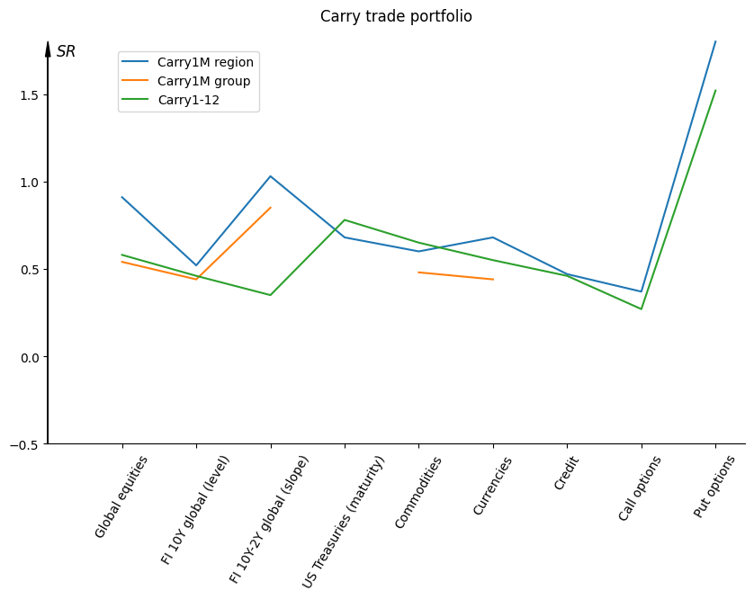 -->

<ul class="slides" style="width:770px; height:550px">
    <input type="radio" name="radio-btn2" id="img-1" checked />
    <li class="slide-container">
        

            
        

        

            <label for="img-2" class="prev">&#x2039;</label>
            <label for="img-2" class="next">&#x203a;</label>
        

    </li>
    <input type="radio" name="radio-btn2" id="img-2" />
    <li class="slide-container">
        

            
        

        

            <label for="img-1" class="prev">&#x2039;</label>
            <label for="img-1" class="next">&#x203a;</label>
        

    </li>
    <li class="nav-dots">
        <label for="img-1" class="nav-dot" id="img-dot-1"></label>
        <label for="img-2" class="nav-dot" id="img-dot-2"></label>
    </li>
</ul>

 这部分结果表明，carry 在不同资产类别中都有稳健的表现，是预期收益率的重要部分。

---

偏度和峰度：

The carry strategies in all asset classes exhibit excess kurtosis, which is typically larger than the kurtosis of the passive long strategy in each asset class, indicating fat-tailed positive and negative returns.

### 3.4 Diversified carry trade portfolio

将每类资产的 carry trade portfolio 按 10% 除以其 in-sample volatility，然后取等权重平均。(方差标准化，但是没有考虑 covariance)

将这种组合称为 `Global carry factor`，作为对比，使用同样的方式构造长期被动组合 $EW$。

results:

Table 2 Panel A: diversified carry trade portfolio has Sharpe ratio of 1.2, higher than the average of the individual carry trade portfolios (0.78). 说明在不同资产间构造 carry trade portfolio 受益于资产多样化。

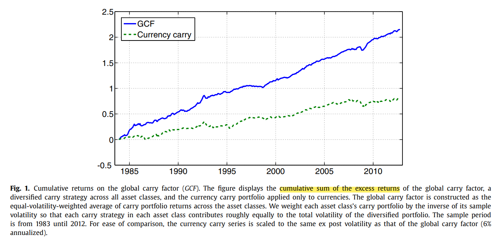

- GCF better than currency carry trade
- both strategies's drawdown periods are similar

### 3.5 How does carry relate to other return predictors?

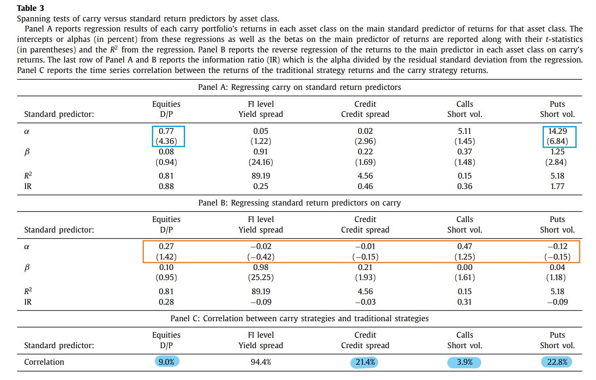

results:

- carry provides new return predictability not explained by standard predictors of returns
- the reverse is not true: carry explains or spans the predictive power of these other variables across all assets. 

> carry thus provides a unifying framework that synthesizes much of the return predictability evidence found in global asset classes. While return predictors across asset classes have mostly been treated disjointly by the literature, carry helps link them together and capture their returns within a single framework.

> [!NOTE|label:Note]
> 这里只是使用各类资产中和 carry 相关的 predictors 相互检验，并不是使用各类资产中解释性最好的 predictors。

Question:

- 各类资产中只用到了一个 predictor，如果用到多个 predictors 结果可能会有变化？
- 现在是收益率解释收益率，如果是特征解释特征会怎样？

### 3.6 Does the market take back part of the carry?

根据 $\ref{(5)}$ 式，carry 对 returns 的预测能力可能来自两方面：

- carry 本身
- carry 可能与 price appreciation 有关

检验 $\ref{(5)}$ 式，对每类资产进行如下面板回归：

$$
\begin{equation}\label{(23)}
  r_{t+1}^i=a^i+b_t+cC_t^i+\varepsilon_{t+1}^i \tag{23}
\end{equation}
$$

- $a^i$: individual fixed effect
- $b_t$: time fixed effect
- $C_t^i$: carry on asset $i$ at time $t$
- $c$: coefficient of how carry predict returns (theoretically, $c=1$)

 

<table>
  <tr>
    <td id="td2l" style="color:#3ab5eb; vertical-align: top"><b>Hypothesis 1:</td>
    <td id="td2l">$c = 0$ means that carry does not predict returns, consistent with a generalized notion of the UIP/EH.</td>
  </tr>
  <tr>
    <td id="td1l" style="white-space: nowrap; color:#3ab5eb; vertical-align: top"><b>Hypothesis 2:</td>
    <td id="td1l">$c = 1$ means that the expected return moves <strong>one-for-one</strong> with carry, price changes (the return excluding carry) are unpredictable by carry.</td>
  </tr>
  <tr>
    <td id="td1l" style="color:#3ab5eb; vertical-align: top"><b>Hypothesis 3:</td>
    <td id="td1l">$c \in (0,1)$ means that a positive carry is associated with a negative expected price appreciation such that the market “takes back” part of the carry, but not all.</td>
  </tr>
  <tr>
    <td id="td1l" style="color:#3ab5eb; vertical-align: top"><b>Hypothesis 4:</td>
    <td id="td1l">$c > 1$ means that a positive carry is associated with a positive expected price appreciation so that an investor gets the carry and price appreciation too, that is, carry predicts further price increases.</td>
  </tr>
  <tr>
    <td id="td3l" style="color:#3ab5eb; vertical-align: top"><b>Hypothesis 5:</td>
    <td id="td3l">$c < 0$ implies that carry predicts such a negative price change that it more than offsets the direct effect of a positive carry.</td>
  </tr>
</table>

> By including both asset and time fixed effects, the slope coefficient c in Eq. (23) represents the predictability of returns to carry coming purely from variation in carry.

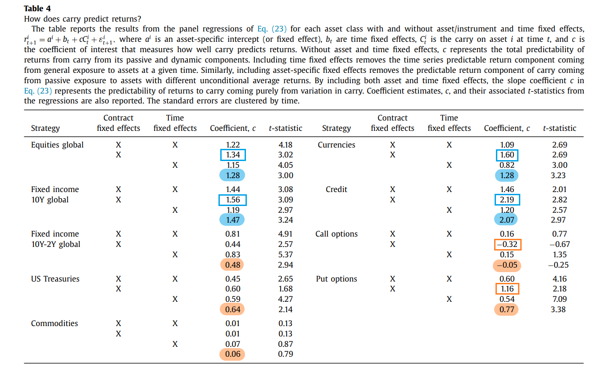

results:

<table>
  <tr>
    <td id="td2l" style="vertical-align: top">Equities:</td>
    <td id="td2l">carry predicts returns more than one-for-one</td>
  </tr>
  <tr>
    <td id="td1l" style="white-space: nowrap; vertical-align: top">Fixed income 10Y global:</td>
    <td id="td1l">carry predicts returns more than one-for-one, additional price appreciation (yield tend to fall), <b>confilct with EH</b> (expectations hypothesis) (according to $\ref{(12)}$, carry increase $\to$ forward rate increase $\overset{EH}{\to}$ yield increase)</td>
  </tr>
  <tr>
    <td id="td3l" style="vertical-align: top">Commodities US Treasuries options:</td>
    <td id="td3l">$c \in (0,1)$, the market takes back part of the carry</td>
  </tr>
</table>

> The carry trade corresponds most closely to the regressions with time fixed effects and without asset fixed effects because we consider a long-short (i.e., crosssectional) trade based on raw carry signals.

---

对每类资产，Fig. 2 展示了 carry trade portfolio 的 return 和 carry 的 cumulative sum:

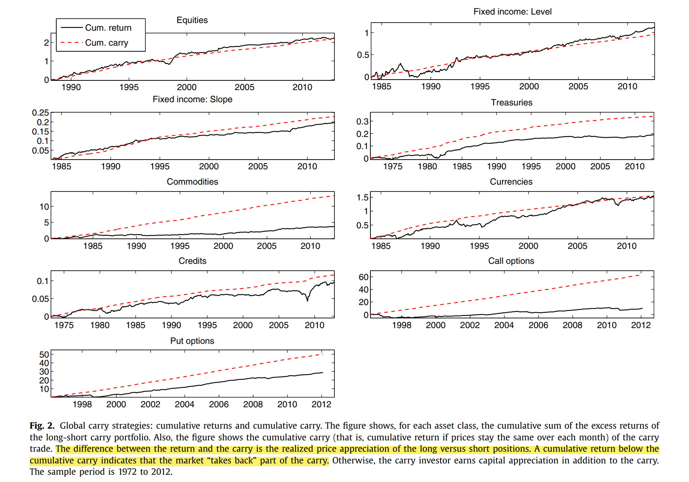

> When the cumulative return is higher than the cumulative carry, it indicates that carry investors earn a price appreciation in addition to the carry, corresponding to a regression coefficient c greater than one.

> A cumulative return lower than the cumulative carry indicates that the market takes back part of the carry (c < 1).

---

不确定是同时考虑 individual 和 time fixed effects 时做出的结果；还是只考虑 individual fixed effects 时做 individual 的结果，只考虑 time fixed effects 时做 time 的结果。感觉差别应该不是特别大。

> We can also examine how the predictive coefficient changes across the different regression specifications with and without fixed effects to see how the predictability of carry changes once the passive exposures are removed.

根据上面这句话，感觉应该是后者。

Column 1 考虑平均 return 和平均 carry 的相关性。如果相关性很高，说明通过 carry 进行排序的策略可以获得正的收益。

Column 2 考虑 $t$ 期 carry 和 $t+1$ 期 return 的相关性。结果中基本都是正的相关性，说明 carry 可以用作择时。

### 3.7 Carry timing

The weight of security i in this case is:

$$
\begin{equation}\label{(24)}
  w_t^i=z_t\left(2\mathbb{I}(\mathbb{C}_t^i-\bar{\mathbb{C}}>0)-1\right) \tag{24}
\end{equation}
$$

其中 $\mathbb{I}(\mathbb{C}_t^i-\bar{\mathbb{C}}>0)$ 是指示函数，当 $\mathbb{C}_t^i > \bar{\mathbb{C}}$ 时，$\mathbb{I}(\mathbb{C}_t^i-\bar{\mathbb{C}}>0) = 1$

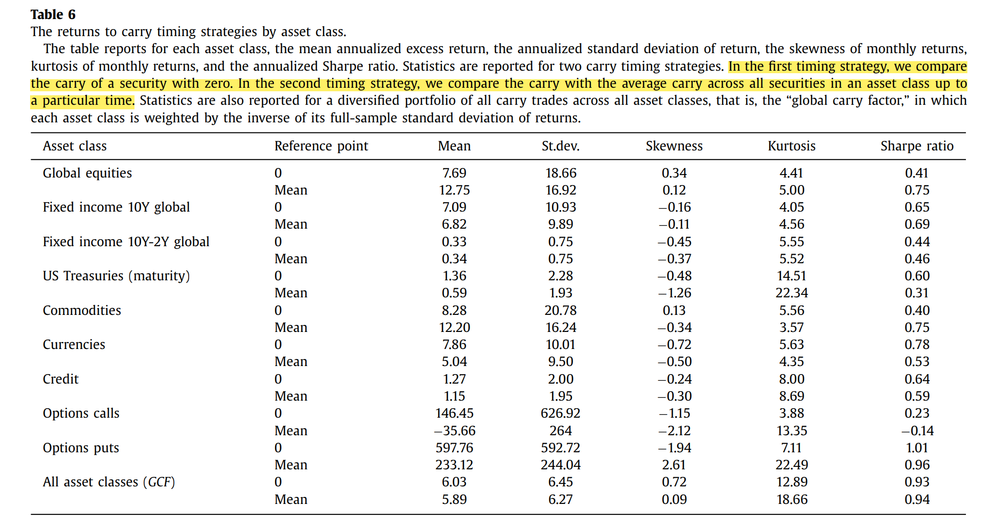

<!-- 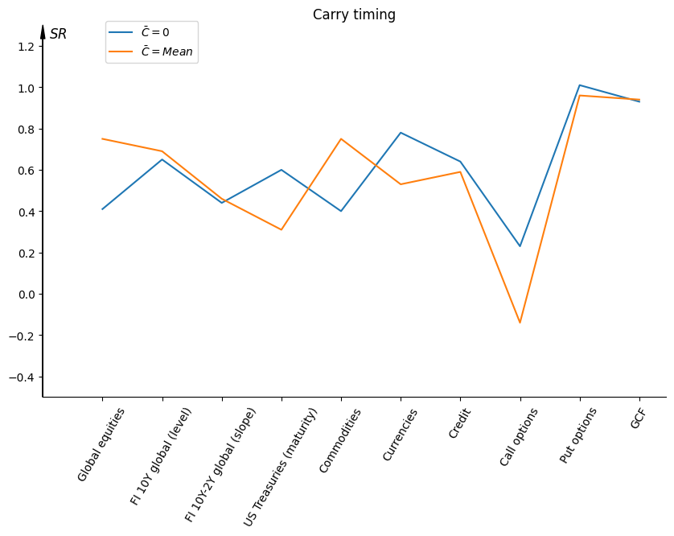 -->

<ul class="slides" style="width:770px; height:550px">
    <input type="radio" name="radio-btn3" id="img-5" checked />
    <li class="slide-container">
        

            
        

        

            <label for="img-6" class="prev">&#x2039;</label>
            <label for="img-6" class="next">&#x203a;</label>
        

    </li>
    <input type="radio" name="radio-btn3" id="img-6" />
    <li class="slide-container">
        

            
        

        

            <label for="img-5" class="prev">&#x2039;</label>
            <label for="img-5" class="next">&#x203a;</label>
        

    </li>
    <li class="nav-dots">
        <label for="img-5" class="nav-dot" id="img-dot-5"></label>
        <label for="img-6" class="nav-dot" id="img-dot-6"></label>
    </li>
</ul>

## 4. Testing potential explanations for carry

这部分探究 carry 能预测收益率的经济学原理。

### 4.1 Common risk: correlations and factor exposures

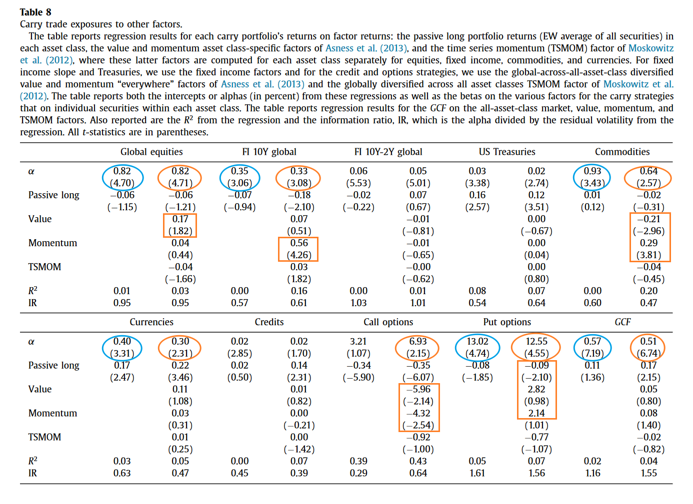

Table 8 将 carry trade portfolio 的收益率与一些常见的风险因子进行回归：

- passive long portfolio: $EW$
- value
- momentum
- time series momentum

每类资产中这些因子独立计算。

results:

- 只对 passive long portfolio 进行回归:
  - 除了 Call，其他资产类别中 $\alpha$ 都很显著
  - 信息比率高：表明即使考虑了 local market index，carry trade portfolio 仍然有较高的 risk-adjusted return
- 对 passive long portfolio, value, momentum, time series momentum 进行回归:
  - equities：value 系数显著 (intuitive but different)，momentum 系数不显著

结论：Other known global factors that explain returns across markets and asset classes, such as value, momentum, and time series momentum, do not capture the returns to carry.

### 4.2 Turnover and transaction costs

如何计算交易成本：

- option: bid-ask spread in OptionMetrics (conservative)
- credit: None
- others: Bollerslev et al. (2016)

Turnover for a given period is computed as:

$$
\begin{equation}\label{(25)}
  Turnover_t=\frac{1}{4}\sum_i\left|w_{t-1}^i(1+r_t^i)-w_t^i\right| \tag{25}
\end{equation}
$$

Tip

假设 $w^i = \frac{X^i}{A}$，其中：

- $w^i$: security $i$ 的权重
- $X^i$: 配置在 security $i$ 上的资金
- $A$: 总资金

$\qquad t-1: w^i_{t-1} = \frac{X^i_{t-1}}{A_{t-1}}$

$\qquad t: w^i_t = \frac{X^i_t}{A_t}$

周转率(换手率) = (某段时期内的成交量)/(发行总股数) $\times$ 100%

$$
\begin{aligned}
  \left|\frac{X^i_{t-1} (1 + r^i_t)}{P_t} - \frac{X^i_t}{P_t}\right|/I_t &= \frac{1}{P_t I_t} \left|X^i_{t-1} (1 + r^i_t) - X^i_t\right| \\
  &= \frac{1}{P_t I_t} \left|A_{t-1} w^i_{t-1} (1 + r^i_t) - A_t w^i_t\right| \\
  &= \frac{1}{P_t I_t} A \left|w^i_{t-1} (1 + r^i_t) - w^i_t\right|
\end{aligned}
$$

假设 $A_{t-1} = A_t = A$

> we divide by four to avoid double-counting (a factor of two) and to adjust for the fact that the long-short strategies have \$2 exposure (another factor of two).

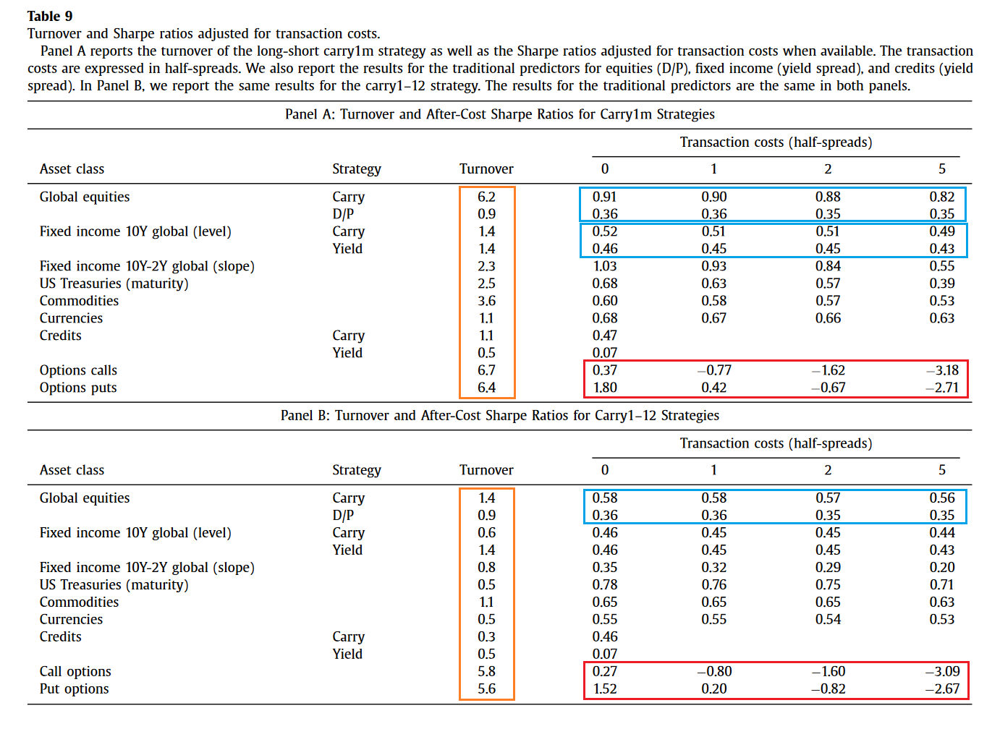

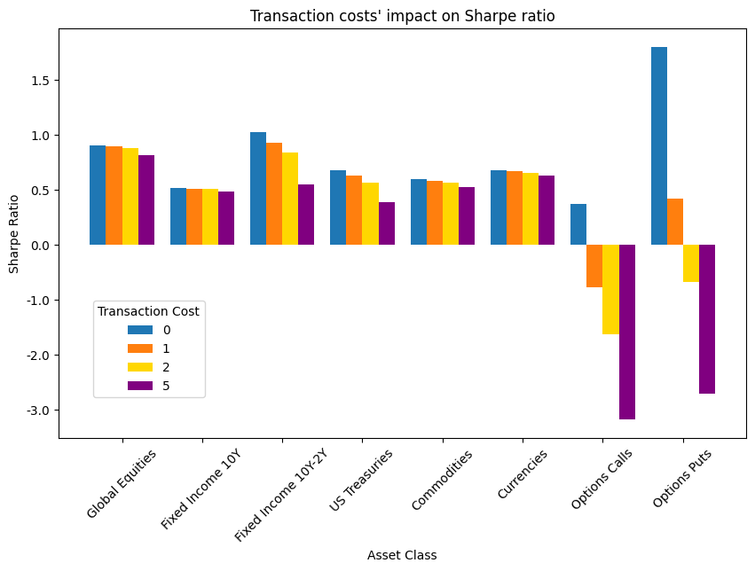

> Taken together, our results cannot be explained by, and are not subsumed by, trading costs.

### 4.3 Crashes and downside risk exposure

许多有关 currency 的研究认为，carry 可能是补偿了 crash risk or business cycle risk。

> We find that all carry strategies produce high Sharpe ratios and often have high kurtosis. However, results regarding skewness are mixed. 
> Furthermore, a diversified carry strategy across all asset classes exhibits little skewness and mitigates the most extreme kurtosis. Hence, these measures of crash risk do not appear to explain carry returns more generally.

研究 downside risk：

$$
\begin{equation}\label{(26)}
  r_t=\beta_0+\beta_{mkt}r_{mt}+\beta_{down}\max\{0,-r_{mt}\}+\epsilon_t \tag{26}
\end{equation}
$$

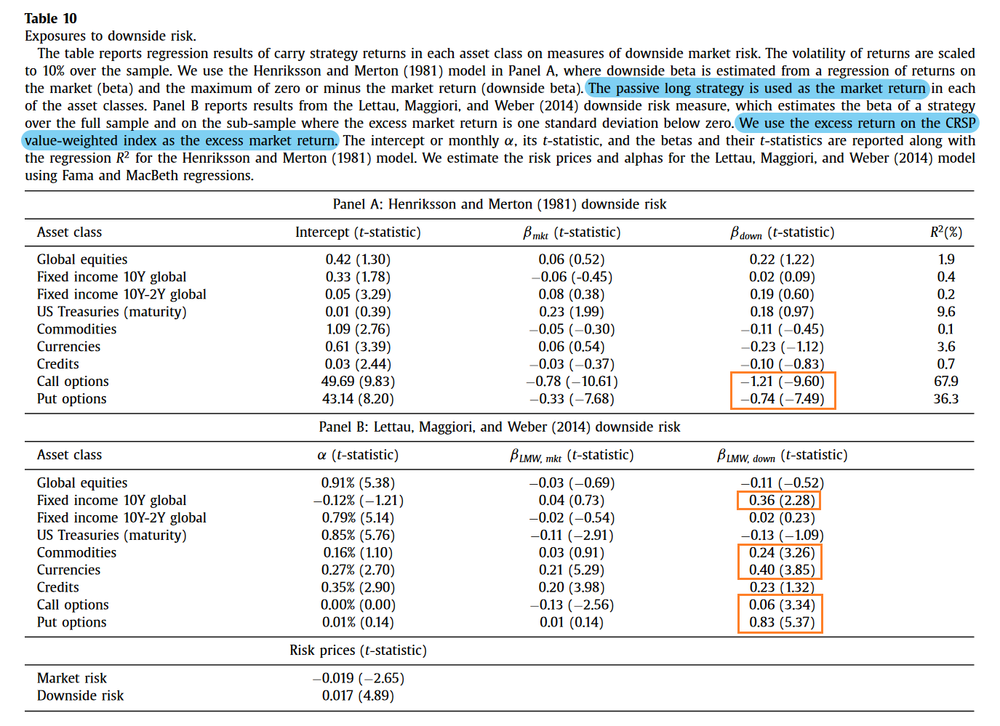

results:

- explained: fixed income, commodities, currencies, both option strategies
- unexplained: other strategies

### 4.4 Global liquidity and volatility risk

还有一部分 currency 的研究认为，carry 可能是补偿了 liquidity risks and volatility risk。

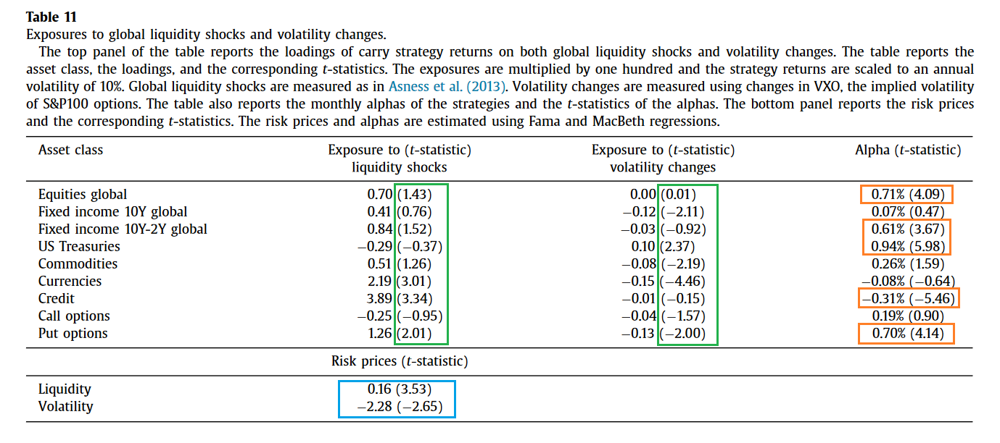

- Aggressive interpretation: carry is unexplained by downside, liquidity, or volatility risks and presents a substantial asset pricing puzzle that rejects many theories, possibly offering a wildly profitable investment opportunity.
- Cautious interpretation: carry strategies **almost uniformly load significantly** on these risks that partially explains their returns and that, perhaps if better measures of these risks were available, most of the returns to carry through risk could be explained.

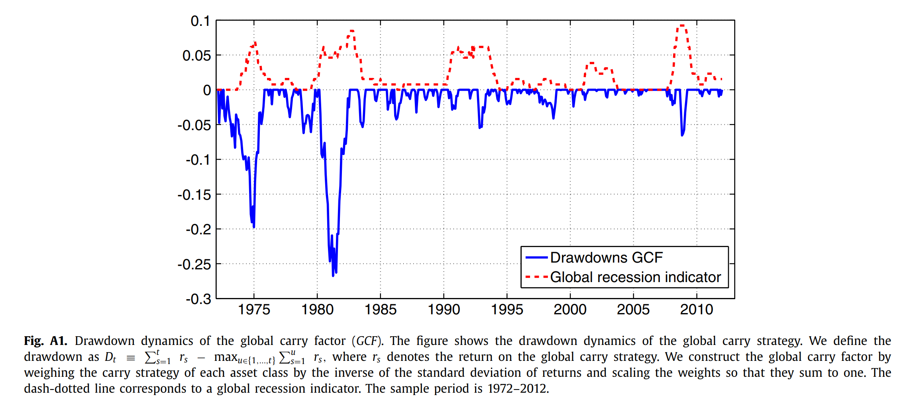

> Explaining the returns to carry simultaneously across all the asset classes we study remains a daunting and challenging task for existing asset pricing theory.

 

  

    <h3>KEY TAKEAWAYS</h3>
    <ul>
      <li>从货币市场拓展到其他市场，均有不错表现，提供了一个大类资产配置的统一框架</li>
      <li>carry 表示投资者不做任何预测时，可以获得的收益</li>
      <ul class="ul1">
        <li class="li1">equities: dividend (forward-looking)</li>
        <li class="li1">bonds: coupon, yield spread</li>
        <li class="li1">currencies: interest rate differential</li>
      </ul>
      <li>而 price appreciation 和 unexpected price shock 代表了资产价格波动的其他原因：市场波动 (供需变化、宏观经济环境、市场情绪)、公司层面 (业绩、技术创新) 等</li>
      <table>
        <tr>
          <td id="td1c"></td>
          <td id="td1c"></td>
          <td id="td3c">intrinsic   $\uparrow$</td>
          <td id="td1c"></td>
          <td id="td3c" colspan="3">captial gain   $\uparrow$</td>
        </tr>
        <tr>
          <td id="td1c">$\mathrm{return}$</td>
          <td id="td1c">$=$</td>
          <td id="td1c">$\mathrm{carry}$</td>
          <td id="td1c">$+$</td>
          <td id="td1c">$\mathrm{E(price\ appreciation)}$</td>
          <td id="td1c">$+$</td>
          <td id="td1c">$\mathrm{unexpected\ price\ shock}$</td>
        </tr>
        <tr>
          <td id="td1"></td>
          <td id="td1"></td>
          <td id="td2" colspan="3">$\downarrow$   expected return</td>
          <td id="td1"></td>
          <td id="td1"></td>
        </tr>
      </table>
    </ul>
  

  

  

## References

- [Robert Hodrick: The Carry Trade](https://www.youtube.com/watch?v=A68bvGbvnHI&t=370s)
- [Uncovered Interest rate parity](https://www.investopedia.com/terms/u/uncoveredinterestrateparity.asp)
- [Covered Interest rate parity $vs$ Uncovered Interest rate parity](https://www.grips.ac.jp/teacher/oono/hp/lecture_F/lec04.htm)
- [Campbell J Y, Shiller R J. The dividend-price ratio and expectations of future dividends and discount factors[J]. The review of financial studies, 1988, 1(3): 195-228.](https://doi.org/10.1093/rfs/1.3.195)
- [Koijen R S J, Moskowitz T J, Pedersen L H, et al. Carry[J]. Journal of Financial Economics, 2018, 127(2): 197-225.](https://doi.org/10.1016/j.jfineco.2017.11.002)